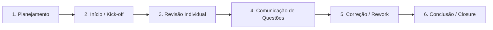

# 📚 Capítulo 3: Teste Estático (Syllabus CTFL v4.0)

Este capítulo examina as técnicas de **teste estático**, que abrangem revisões humanas e análise estática automatizada de produtos de trabalho sem a necessidade de executar o código-fonte.

---

## 1. O que é Teste Estático?

Diferente do teste dinâmico (que exige a execução do software em um computador), o teste estático analisa artefatos de software (requisitos, arquitetura, código, histórias de usuário, planos de teste) para **encontrar defeitos diretamente**, antes que eles se convertam em falhas operacionais.

### 1.1 Teste Estático vs. Teste Dinâmico

| Característica | Teste Estático | Teste Dinâmico |
| :--- | :--- | :--- |
| **Execução** | Sem execução de código. | Requer execução do código em ambiente controlado. |
| **Alvo Principal** | Encontra **Defeitos** diretamente nos artefatos. | Mostra **Falhas** causadas por defeitos no código. |
| **Momento de Aplicação** | Muito precoce no SDLC (*Shift-Left*). | Após a construção de módulos ou componentes executáveis. |
| **Custo de Correção** | Extremamente baixo (previne a propagação de erros). | Mais elevado (requer depuração, re-compilação e re-testes). |
| **Exemplos de Defeitos** | Contradições em requisitos, falhas de segurança no código, desvios de padrão, código morto. | Estouro de memória, falha de cálculo em tempo de execução, timeouts de rede. |

---

## 2. Processo de Revisão

As revisões humanas variam da conversa informal até inspeções altamente estruturadas.

### 2.1 As 6 Etapas do Processo Formal de Revisão

1. **Planejamento**: Definição do escopo, alocação de papéis, estimativa de tempo e avaliação de critérios de entrada.
2. **Início (Kick-off)**: Distribuição do produto de trabalho e explicação dos objetivos aos revisores.
3. **Revisão Individual**: Cada revisor analisa o documento isoladamente, identificando potenciais defeitos, dúvidas e observações.
4. **Comunicação e Registro de Questões**: Reunião presencial/remota para discutir os achados, consolidar a lista de defeitos e decidir sobre ações.
5. **Correção (Rework)**: O autor corrige os defeitos aceitos na lista.
6. **Conclusão (Closure)**: Verificação das correções contra critérios de saída para aprovação final do documento.

### 2.2 Papéis em uma Revisão Formal
* **Autor**: Criador do produto de trabalho a ser revisado (corrige os defeitos encontrados).
* **Gerente**: Decide sobre a realização da revisão, aloca tempo e orçamento.
* **Líder da Revisão (*Review Leader*)**: Assume a responsabilidade geral pela condução da revisão (organiza a equipe e prazos).
* **Facilitador (Moderador)**: Garante a neutralidade, media discussões de conflito, gerencia o tempo (*timebox*) e assegura o bom andamento da reunião.
* **Revisores**: Especialistas técnicos ou de negócio que inspecionam o artefato em busca de defeitos.
* **Redator (*Scribe*)**: Documenta todos os defeitos, dúvidas e decisões tomadas durante a reunião de revisão.

---

## 3. Tipos de Revisão

O Syllabus CTFL v4.0 classifica as revisões em 4 tipos principais, ordenadas do menor ao maior grau de formalidade:

### 3.1 Revisão Informal (*Informal Review*)
* **Formalidade**: Nula ou muito baixa.
* **Características**: Duas pessoas revisando um código/requisito (ex.: *Pair Programming* ou envio casual por mensagem). Não exige processo formal, reunião ou relatório.

### 3.2 Walkthrough (Passagem Guiada)
* **Formalidade**: Baixa a média.
* **Características**: Conduzida pelo **próprio Autor**. O autor guia os participantes através do documento, explicando a lógica e coletando feedback. Útil para transmitir conhecimento e validar entendimento.

### 3.3 Revisão Técnica (*Technical Review*)
* **Formalidade**: Média a alta.
* **Características**: Conduzida por especialistas técnicos (arquitetos, engenheiros seniores). Foca em avaliar a viabilidade técnica, consistência arquitetural e conformidade com padrões. Pode ter ou não um moderador.

### 3.4 Inspeção (*Inspection*)
* **Formalidade**: Máxima.
* **Características**: O tipo mais rigoroso de revisão. Liderada por um **Facilitador (Moderador) treinado** (que não é o autor). Utiliza papéis estritos, *checklists*, métricas e critérios rígidos de entrada e saída.

---

## 4. Técnicas de Revisão

Como os revisores devem analisar o documento durante a revisão individual?

1. **Ad Hoc**: Os revisores leem o documento sem nenhuma orientação prévia. Altamente dependente da habilidade individual (pode gerar registros duplicados).
2. **Baseada em Checklists**: Os revisores usam uma lista pré-definida de perguntas/critérios para guiar a busca por problemas comuns.
3. **Cenários e Dry-Runs**: Os revisores executam simulações mentais guiadas por cenários de uso para verificar o comportamento descrito.
4. **Baseada em Papéis (*Role-Based*)**: O revisor analisa o documento assumindo a perspectiva de um papel específico (ex.: administrador de banco de dados, usuário final, analista de segurança).
5. **Baseada em Perspectivas (*Perspective-Based Reading - PBR*)**: A técnica mais eficaz segundo estudos. Cada revisor adota a visão de um stakeholder diferente (ex.: testador, desenvolvedor, designer) e tenta construir um produto derivado a partir do documento.

---

## 5. Análise Estática Automatizada

Ferramentas de análise estática examinam o código-fonte ou modelos sem executá-los.

### Benefícios da Análise Estática
* Identifica defeitos difíceis de encontrar em testes dinâmicos (ex.: vazamentos de memória, variáveis não inicializadas, código morto).
* Identifica **vulnerabilidades de segurança** (SAST - *Static Application Security Testing*).
* Garante a conformidade com regras de codificação (*linters*, SonarQube).
* Avalia métricas de código (ex.: **Complexidade Ciclomática de Cyclomatic Complexity**).
