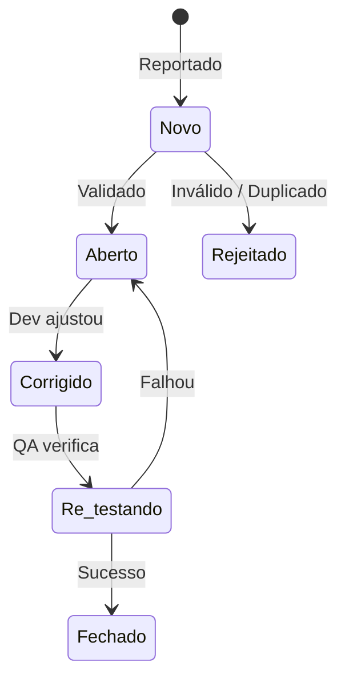

# 📚 Capítulo 5: Gerenciamento das Atividades de Teste (Syllabus CTFL v4.0)

Este capítulo trata da liderança, planejamento, estimativa, estratégia baseada em riscos, monitoramento, controle e gestão de defeitos durante o ciclo de testes.

---

## 1. Planejamento e Estratégia de Teste

O planejamento de teste define o escopo, a abordagem, os recursos e o cronograma das atividades de QA.

### 1.1 Conteúdo de um Plano de Teste (Norma ISO/IEC/IEEE 29119-3)
* Escopo e objetivos do teste.
* Riscos de produto e riscos de projeto.
* Abordagem de teste (estratégia).
* Critérios de entrada e critérios de saída (*Definition of Ready* / *Definition of Done*).
* Cronograma, marcos (*milestones*) e estimativa de esforço.
* Papéis e responsabilidades na equipe.
* Necessidades do ambiente de teste e *testware*.

### 1.2 Estratégias de Teste (Abordagens)

| Estratégia | Descrição |
| :--- | :--- |
| **Analítica** | Baseada em análise formal de riscos (*Risk-Based Testing*) ou análise de requisitos. |
| **Baseada em Modelos** | Constrói modelos do sistema (ex.: diagramas de transição de estados) para guiar o teste. |
| **Metodológica** | Utiliza suítes de teste padronizadas ou listas de verificação de falhas conhecidas. |
| **Conforme Processo / Regulatória** | Segue normas de padrões da indústria (ex.: ISO 26262, DO-178C, FDA). |
| **Consultiva / Dirigida** | Orientada pelas diretrizes e conselhos de especialistas técnicos ou usuários. |
| **Aversa à Regressão** | Foca em automatizar a suíte de testes existente para evitar quebras por novas alterações. |
| **Reativa** | Baseada em reação em tempo real durante a execução (ex.: testes exploratórios). |

---

## 2. Critérios de Entrada e Saída (DoR / DoD)

Em metodologias ágeis, os critérios de entrada e saída correspondem às definições de pronto e concluído:

* **Critérios de Entrada (*Definition of Ready - DoR*)**: Pré-condições necessárias para iniciar com segurança a fase ou execução de testes (ex.: ambiente configurado, dados de teste disponíveis, estória aprovada).
* **Critérios de Saída (*Definition of Done - DoD*)**: Condições mínimas necessárias para declarar uma atividade ou ciclo de teste concluído com sucesso (ex.: $100\%$ das suítes de alta prioridade executadas, taxa de aprovação $\ge 95\%$, sem defeitos críticos abertos).

---

## 3. Estimativa e Monitoramento de Testes

### 3.1 Técnicas de Estimativa
1. **Baseada em Métricas**: Utiliza dados históricos de projetos anteriores (ex.: número de testes executados por dia, densidade de defeitos).
2. **Baseada em Especialistas**: Baseada na experiência dos membros da equipe (ex.: técnica *Wideband Delphi* ou *Planning Poker*).

### 3.2 Métricas de Teste
* **Progresso da Execução**: Percentual de testes passados, falhados, bloqueados e pendentes.
* **Densidade de Defeitos**: Número de defeitos por KLOC (mil linhas de código) ou por História de Usuário.
* **Cobertura**: Porcentagem de requisitos, códigos ou riscos exercitados pelos testes.

---

## 4. Gerenciamento de Riscos

O risco é a possibilidade de ocorrência de um evento futuro com consequências negativas, mensurado por:

$$\text{Nível de Risco} = \text{Probabilidade (Verossimilhança)} \times \text{Impacto}$$

```mermaid
quadrantChart
    title Matriz de Avaliação de Riscos
    x-axis Baixa Probabilidade --> Alta Probabilidade
    y-axis Baixo Impacto --> Alto Impacto
    quadrant-1 Testar Primeiro (Prioridade Máxima)
    quadrant-2 Prioridade Média-Alta
    quadrant-3 Baixa Prioridade
    quadrant-4 Prioridade Média
```

### 4.1 Risco de Produto vs. Risco de Projeto
* **Risco de Produto (Risco de Qualidade)**: Relaciona-se com falhas no comportamento do software (ex.: cálculo de juros incorreto, vazamento de dados, resposta lenta sob carga).
* **Risco de Projeto (Risco de Gestão)**: Relaciona-se com a entrega e operação do projeto (ex.: atraso na entrega do hardware de rede, falta de pessoal qualificado, estouro de orçamento).

### 4.2 Teste Baseado em Riscos (*Risk-Based Testing - RBT*)
No RBT, os riscos de produto orientam a priorização e alocação do esforço de teste:
1. Módulos com **maior risco (Alto Impacto + Alta Probabilidade)** são desenvolvidos e testados **primeiro**.
2. Suítes de teste de alto risco recebem maior rigor e atenção na automação.

---

## 5. Gerenciamento de Defeitos

Um Relatório de Defeitos (*Defect Report*) deve ser registrado de forma clara, objetiva e construtiva.

### 5.1 Estrutura Essencial de um Relatório de Defeitos
* **ID e Título Conciso**: Identificação única e descrição sumarizada do problema.
* **Ambiente e Versão**: Sistema operacional, navegador, versão do código e banco de dados.
* **Passos para Reproduzir**: Instruções detalhadas passo a passo para replicar a falha.
* **Resultado Esperado vs. Resultado Atual**: Comportamento especificado vs. comportamento observado.
* **Evidências**: Capturas de tela, logs do servidor, rastros de stack (*stack trace*).
* **Gravidade (*Severity*)**: Impacto técnico do defeito no funcionamento do sistema.
* **Prioridade (*Priority*)**: Urgência de negócio para a correção do defeito.

### 5.2 Ciclo de Vida do Defeto


